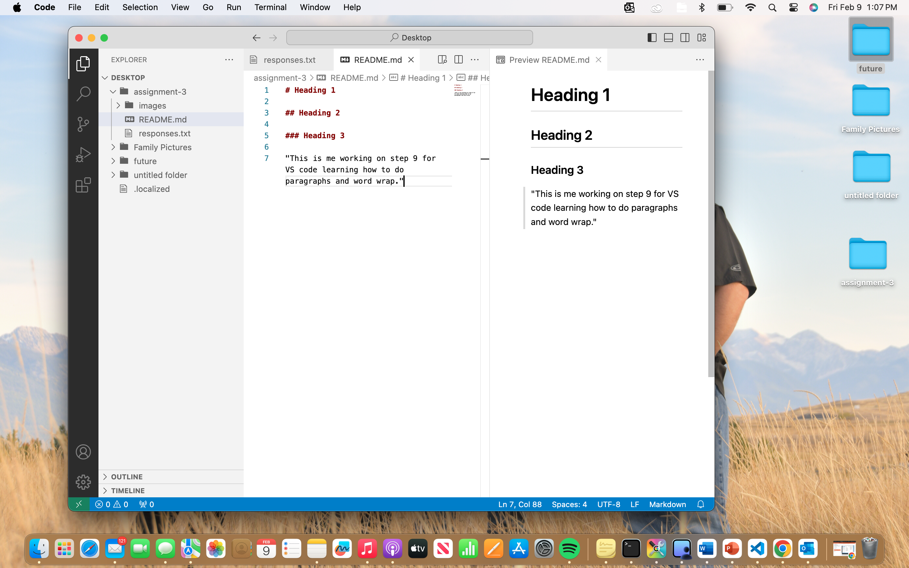

# Heading 1

## Heading 2

### Heading 3

"This is me working on step 9 for VS code learning how to do paragraphs and word wrap."

[Click Here](https://en.wikipedia.org/wiki/Pug)

[My File](./responses.txt)

